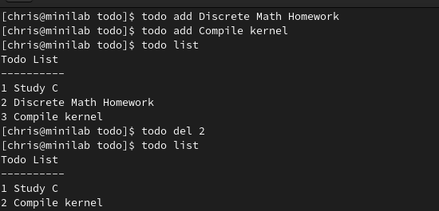

# Todo List

### A terminal application to help you do more today! 

### Prereqs
- Make
- GCC

### Install
`make`

`sudo make install`

### Usage
`todo add item`

`todo list`

`todo del num`

### Example

